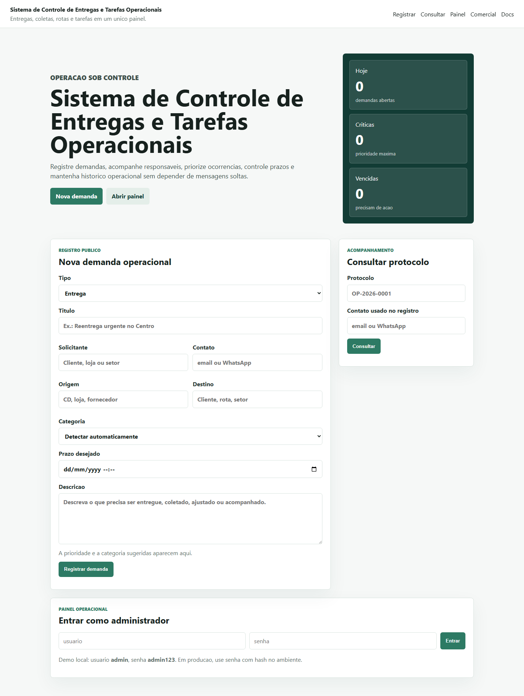
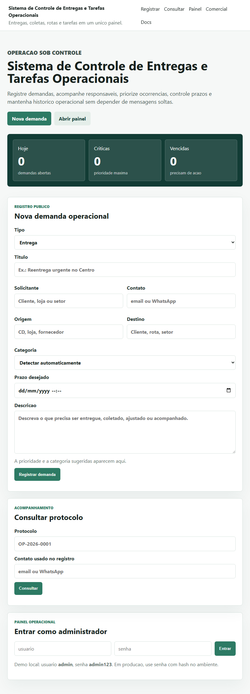
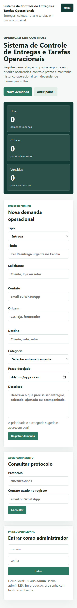
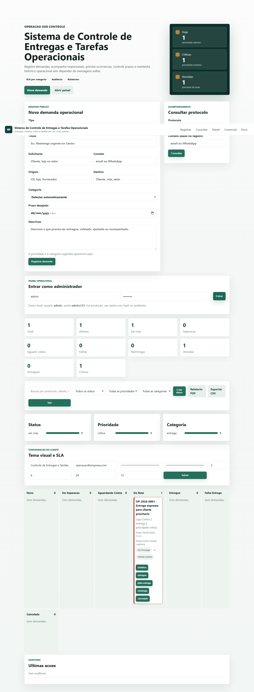
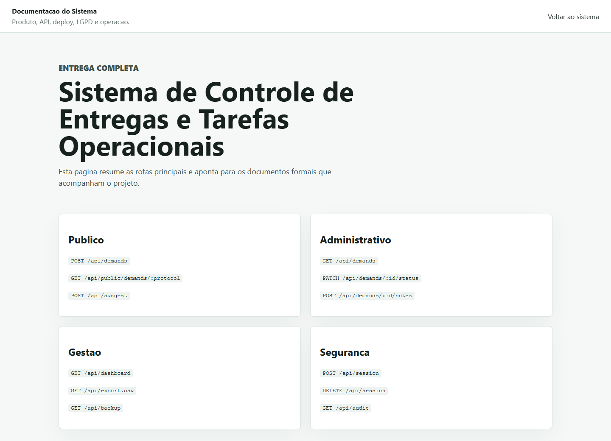

# Sistema de Controle de Entregas e Tarefas Operacionais

[](https://github.com/csantos18/sistema-controle-entregas-tarefas-operacionais/actions/workflows/ci.yml)

Sistema web para registrar, priorizar, acompanhar e auditar entregas, coletas, rotas e tarefas internas. O projeto inclui tela publica, painel operacional, API REST, regras de SLA, permissoes, relatorios, exportacao, upload de comprovantes e documentacao para deploy.

## Visao Geral

Operacoes logisticas e equipes internas costumam receber demandas por canais soltos: mensagens, ligacoes, planilhas e e-mails. Isso dificulta prazos, responsaveis, evidencias e indicadores.

Este sistema centraliza o fluxo:

- o solicitante registra uma entrega, coleta ou tarefa;
- o sistema gera protocolo no formato `OP-AAAA-0001`;
- o solicitante consulta o andamento com protocolo e contato;
- a equipe acompanha tudo em painel administrativo;
- gestores consultam indicadores, historico, auditoria, anexos, exportacoes e relatorios.

## Preview

| Tela publica | Tablet | Mobile |
| --- | --- | --- |
|  |  |  |

| Painel operacional | Documentacao visual |
| --- | --- |
|  |  |

Para gerar os screenshots novamente:

```bash
npm run screenshots
```

## Destaques

- Produto completo: pagina publica, painel operacional, pagina comercial, documentacao visual e API REST.
- Regra de negocio real: protocolo unico, SLA por prioridade/categoria e status com transicoes controladas.
- Operacao acompanhavel: dashboard, kanban, filtros, busca, historico, notas e auditoria.
- Seguranca aplicada: sessao assinada, cookie `HttpOnly`, expiracao de sessao, senha com `scrypt`, permissoes por perfil, headers de seguranca, protecao contra origem cruzada e limite basico de requisicoes.
- Persistencia flexivel: JSON local para demo/homologacao e migrations PostgreSQL para producao robusta.
- Qualidade verificavel: testes automatizados, validacao de sintaxe, screenshots, backup e documentacao de deploy.
- Experiencia profissional: layout responsivo, menu mobile, tema configuravel por cliente, CSV e relatorio imprimivel.

## Funcionalidades

### Solicitante

- Registro publico de entrega, coleta ou tarefa.
- Sugestao automatica de categoria e prioridade por palavras-chave.
- Geracao de protocolo.
- Consulta publica segura por protocolo e contato.
- Visualizacao de status, responsavel, prazo, origem, destino e ultima nota publica.

### Operacao

- Login administrativo protegido por sessao.
- Dashboard com indicadores por status, prioridade, categoria e atrasos.
- Kanban operacional com demandas abertas.
- Filtros por status, prioridade, categoria, tipo, responsavel e busca livre.
- Alteracao de status respeitando transicoes permitidas.
- Registro de notas publicas e internas.
- Detalhe completo da demanda com historico, anexos e comprovantes.
- Upload de arquivos PNG, JPG, WEBP ou PDF.
- Exportacao CSV, backup JSON e relatorio imprimivel.
- Tema visual configuravel por cliente.
- Seed demo para apresentacoes comerciais.

### Administracao

- Perfis: `admin`, `supervisor`, `operador` e `leitura`.
- Criacao, bloqueio/desbloqueio e edicao de usuarios administrativos.
- Troca de senha.
- Auditoria por ator e acao.
- Monitoramento de demandas vencidas.
- Notificacoes opcionais por webhook e e-mail SMTP.

## Stack

| Area | Tecnologias |
| --- | --- |
| Front-end | HTML, CSS, JavaScript |
| Back-end | Node.js, Express |
| Banco de dados | JSON local, PostgreSQL preparado |
| Uploads | Multer |
| Notificacoes | Webhook, SMTP/Nodemailer |
| Testes | Node Test Runner, `node --check`, Playwright |
| Deploy | Render, Vercel Preview, disco persistente, variaveis de ambiente |

## Como Rodar Localmente

```bash
npm install
npm start
```

Depois acesse:

```text
http://localhost:3000
```

Credenciais locais de demonstracao:

```text
usuario: admin
senha: admin123
```

Em producao, nao use a senha local. Configure `ADMIN_PASSWORD_HASH` com hash forte.

## Variaveis de Ambiente

Crie um `.env` local com base em `.env.example`.

Variaveis principais:

```text
PORT=3000
DATA_FILE=data/database.json
SESSION_SECRET=seu-segredo-de-sessao
SESSION_MAX_AGE_MS=28800000
ADMIN_USER=admin
ADMIN_PASSWORD_HASH=hash-scrypt-da-senha
UPLOAD_DIR=uploads
DATABASE_URL=postgresql://...
NOTIFICATION_WEBHOOK_URL=https://exemplo.com/webhook
SMTP_HOST=smtp.exemplo.com
SMTP_PORT=587
SMTP_USER=usuario
SMTP_PASS=senha
NOTIFICATION_EMAIL_TO=operacao@empresa.com
```

Para gerar o hash da senha:

```bash
npm run hash:password -- "sua-senha-forte"
```

## Preview Online

O projeto esta preparado para preview na Vercel usando `vercel.json` e `api/index.js`.

No preview serverless, o app usa arquivo temporario em `/tmp`. Isso e suficiente para demonstracao visual e navegacao de portfolio, mas nao deve ser tratado como producao definitiva.

Para producao com persistencia real, use Render com disco persistente ou PostgreSQL conforme `docs/DEPLOY.md`.

## Qualidade e Testes

```bash
npm test
npm run check
npm run screenshots
npm run backup
npm audit --omit=dev
```

Os testes cobrem:

- classificacao automatica de categoria e prioridade;
- validacao de campos obrigatorios;
- criacao de demanda e geracao de protocolo;
- consulta publica por protocolo e contato;
- login administrativo e protecao de rotas;
- headers de seguranca e bloqueio de origem cruzada;
- alteracao de status e bloqueio de transicao invalida;
- notas, relatorios, exportacao, backup, upload e auditoria.

O repositorio tambem possui GitHub Actions em `.github/workflows/ci.yml`, validando automaticamente `npm ci`, `npm run check` e `npm audit --omit=dev` em Node.js 20 e 22.

## Seguranca

- Painel protegido por sessao administrativa assinada.
- Cookie `HttpOnly`, `SameSite=Lax` e `Secure` em producao.
- Expiracao configuravel de sessao.
- Senhas novas armazenadas com `scrypt`.
- Compatibilidade com hashes legados SHA-256 para migracao.
- Comparacao segura com `timingSafeEqual`.
- Permissoes por perfil.
- Headers de seguranca: CSP, `X-Frame-Options`, `X-Content-Type-Options`, `Referrer-Policy` e `Permissions-Policy`.
- Protecao basica contra origem cruzada em metodos de escrita.
- Rate limit simples por IP e rota.
- Consulta publica exige protocolo e contato.
- Notas internas nao aparecem na consulta publica.
- Upload limitado por extensao e tamanho.
- Arquivos enviados ficam protegidos por rota administrativa.
- Variaveis sensiveis ficam fora do Git.

## Regras de Negocio

- Toda demanda precisa ter tipo, titulo, solicitante, contato e descricao.
- Tipos validos: `entrega`, `coleta`, `tarefa`.
- Categorias validas: `entrega`, `coleta`, `rota`, `estoque`, `manutencao`, `administrativo`.
- Prioridades validas: `baixa`, `media`, `alta`, `critica`.
- Demandas nascem com status `novo`.
- Status finais `entregue` e `cancelado` nao aceitam nova transicao.
- Demandas fora do prazo ficam marcadas como vencidas.
- Para marcar como `entregue`, o operador precisa informar observacao final e comprovante.
- A consulta publica retorna apenas dados seguros da demanda.

## Persistencia

O app funciona em dois modos:

- JSON local: recomendado para desenvolvimento, demonstracao e homologacao simples.
- PostgreSQL: recomendado para producao robusta.

Para aplicar migrations PostgreSQL:

```bash
npm run db:migrate
```

Para gerar backup local do JSON:

```bash
npm run backup
```

## Rotas Principais

### Publicas

```text
GET  /
GET  /docs.html
GET  /comercial.html
GET  /api/health
POST /api/demands
GET  /api/public/demands/:protocol?contact=...
POST /api/suggest
```

### Administrativas

```text
POST   /api/session
DELETE /api/session
GET    /api/settings
PUT    /api/settings
GET    /api/admins
POST   /api/admins
PATCH  /api/admins/:id
POST   /api/me/password
GET    /api/demands
GET    /api/demands/:id
PATCH  /api/demands/:id
PATCH  /api/demands/:id/status
POST   /api/demands/:id/notes
POST   /api/demands/:id/attachments
POST   /api/demands/:id/files
GET    /api/dashboard
GET    /api/reports
GET    /api/report.pdf
GET    /api/export.csv
GET    /api/backup
GET    /api/audit
POST   /api/demo/seed
```

## Documentacao

- `docs/PRD.md`: produto, publico-alvo, requisitos e roadmap.
- `docs/DEPLOY.md`: deploy em Vercel/Render e variaveis.
- `docs/OPERACAO_CLIENTE.md`: operacao diaria.
- `docs/RELATORIO_TECNICO.md`: detalhes tecnicos.
- `docs/PROPOSTA_COMERCIAL.md`: posicionamento comercial.
- `docs/POLITICA_PRIVACIDADE_LGPD.md`: privacidade e LGPD.
- `docs/CHECKLIST_IMPLANTACAO.md`: checklist de implantacao.

## Status

Projeto pronto para portfolio profissional e demonstracao controlada. Para producao real, use variaveis fortes, HTTPS, armazenamento persistente e valide o checklist de implantacao.

## Autor

Carlos Eduardo Neves dos Santos
